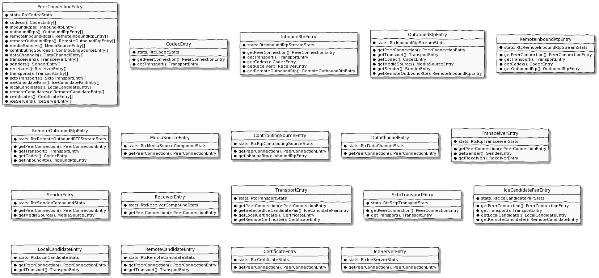

ObserveRTC Client Integration Javascript Library
---

@observertc/client-monitor-js is a client side library to monitor [WebRTCStats](https://www.w3.org/TR/webrtc-stats/) and to integrate your app to observertc components.

Table of Contents:

 * [Quick Start](#quick-start)
 * [Storage Navigations](#storage-navigation)
 * [Connect to Observer](#connect-to-observer)
 * [Configurations](#configurations)
 * [Examples](#examples)
    - [Calculate video tracks Fps](#calculate-video-tracks-fps)
    - [Collect RTT measurements for peer connections](#collect-rtt-measurements-for-peer-connections)
 * [NPM package](#npm-package)
 * [API docs](#api-docs)
 * [Getting Involved](#getting-involved)
 * [License](#license)

## Qucik Start

Install it from [npm](https://www.npmjs.com/package/@observertc/client-monitor-js) package repository.

```
npm i @observertc/client-monitor-js
```

Use it in your WebRTC application. 

```javascript
import { ClientMonitor } from "@observertc/client-monitor-js";
// see full config in Configuration section
const config = {
    collectingPeriodInMs: 5000,
};
const monitor = ClientMonitor.create(config);
monitor.addStatsCollector({
    id: "collectorId",
    getStats: () => peerConnection.getStats(),
});

monitor.events.onStatsCollected(() => {
    const storage = monitor.storage;
    for (const inboundRtp of storage.inboundRtps()) {
        const trackId = inboundRtp.getTrackId();
        const remoteOutboundRtp = inboundRtp.getRemoteOutboundRtp();
        console.log(trackId, inboundRtp.stats, remoteOutboundRtp.stats);
    }
})
```

The above example collect stats in every 5s. 
When stats are collected the inboundRtp entries are iterated.
The stats of the inboound-rtp, its corresponded trackId and remote outbound stats are logged.


## Storage Navigations

 StatsStorage provided entries can be used to navigate from one stats type to another.



## Connect to Observer

The client-monitor can be connected to an [Observer](https://github.com/ObserveRTC/observer).

```javascript
import { ClientMontior } from "@observertc/client-monitor-js";
// see full config in Configuration section
const config = {
    collectingPeriodInMs: 5000,
    samplingPeriodInMs: 10000,
    sendingPeriodInMs: 15000,
    sampler: {
        roomId: "testRoom",
    },
    sender: {
        websocket: {
            urls: ["ws://localhost:7080/samples/myServiceId/myMediaUnitId"]
        }
    }
};
const monitor = ClientMontior.create(config);
monitor.addStatsCollector({
    id: "collectorId",
    getStats: () => peerConnection.getStats(),
});
```

The stats are collected in every 5s, but samples are only made in every 10s. Samples are sent to the observer in every 15s.


## Configurations

```javascript
const config = {
    /**
     * By setting it, the monitor calls the added statsCollectors periodically
     * and pulls the stats.
     * 
     * DEFAULT: undefined
     */
    collectingPeriodInMs: 5000,
    /**
     * By setting it, the monitor make samples periodically.
     * 
     * DEFAULT: undefined
     */
    samplingPeriodInMs: 10000,

    /**
     * By setting it, the monitor sends the samples periodically.
     * 
     * DEFAULT: undefined
     */
    sendingPeriodInMs: 10000,

    /**
     * By setting it stats items and entries are deleted if they are not updated.
     * 
     * DEFAULT: undefined
     */
    statsExpirationTimeInMs: 60000,

    /**
     * Collector Component related configurations
     * 
     * DEFAULT: configured by the monitor
     */
    collectors: {
        /**
         * Sets the adapter adapt different browser type and version 
         * provided stats.
         * 
         * DEFAULT: configured by the monitor
         */
        adapter: {
            /**
             * the type of the browser, e.g.: chrome, firefox, safari
             * 
             * DEFAULT: configured by the collector
             */
            browserType: "chrome",
            /**
             * the version of the browser, e.g.: 97.xx.xxxxx
             * 
             * DEFAULT: configured by the collector
             */
            browserVersion: "97.1111.111",
        },
    },

    /**
     * Sampling Component Related configurations
     * 
     */
    sampler: {
        /**
         * The identifier of the room the clients are in.
         * 
         * If server side componet is used to collect the samples, this parameter is the critical to provide to match clients being in the same room.
         * 
         * DEFAULT: a generated unique value
         * 
         * NOTE: if this value has not been set clients which are in the same room will not be matched at the monitor
         */
        roomId: "testRoom",

        /**
         * The identifier of the client. If it is not provided, then it a UUID is generated. If it is provided it must be a valid UUID.
         * 
         * DEFAULT: a generated unique value
         */
        clientId: "clientId",

        /**
         * the identifier of the call between clients in the same room. If not given then the server side assigns one. If it is given it must be a valid UUID.
         * 
         * DEFAULT: undefined
         */
        callId: "callId",
        /**
         * The userId of the client appeared to other users.
         * 
         * DEFAULT: undefined
         */
        userId: "testUser",

        /**
         * Indicate if the sampler only sample stats updated since the last sampling.
         * 
         * DEFAULT: true
         */
        incrementalSampling: true,
    },
    /**
     * Configure the sender component.
     */
    sender: {
        /**
         * Configure the format used to transport samples or receieve 
         * feedback from the server.
         * 
         * Possible values: json, protobuf
         * 
         * DEFAULT: json
         * 
         */
        format: "json",
         /**
         * Websocket configuration to transport the samples
         */
        websocket: {
            /**
             * Target urls in a priority order. If the Websocket has not succeeded for the first,
             * it tries with the second. If no more url left the connection is failed
             * 
             */
            urls: ["ws://localhost:7080/samples/myServiceId/myMediaUnitId"],
            /**
             * The maximum number of retries to connect to a server before,
             * tha connection failed is stated.
             * 
             * DEFAULT: 3
             */
            maxRetries: 1,
        }
    }
};
```

## NPM package

https://www.npmjs.com/package/@observertc/client-monitor-js

## API docs

https://observertc.github.io/client-monitor-js/modules/ClientMonitor.html


## Examples

### Calculate video tracks Fps

Assuming you have a configured and running monitor and a collector you added to poll the stats from
peer connection, here is an example to calculate the frame per sec for tracks.

```javascript
const monitor = //.. defined above
monitor.onStatsCollected(() => {
    const now = Date.now();
    for (const inboundRtp of monitor.storage.inboundRtps()) {
        const trackId = inboundRtp.getTrackId();
        const SSRC = inboundRtp.getSsrc();
        const traceId = `${trackId}-${SSRC}`;
        // lets extract what we need from the stats for inboundRtp: https://www.w3.org/TR/webrtc-stats/#inboundrtpstats-dict*
        const { framesReceived, kind } = inboundRtp.stats;
        if (kind !== "video") continue;
        const trace = traces.get(traceId);
        if (!trace) {
            traces.set(traceId, {
                framesReceived,
                timestamp: now,
            });
            continue;
        }
        const elapsedTimeInS = (now - trace.timestamp) / 1000;
        const fps = (framesReceived - trace.framesReceived) / elapsedTimeInS;
        const peerConnectionId = inboundRtp.getPeerConnection()?.id;
        trace.framesReceived = framesReceived;
        trace.timestamp = now;

        console.log(`On peerConnection: ${peerConnectionId}, track ${trackId}, SSRC: ${SSRC} the FPS is ${fps}`);
    }
});
```

### Collect RTT measurements for peer connections

```javascript
const monitor = //.. defined above
monitor.onStatsCollected(() => {
    const RTTs = new Map();
    for (const outboundRtp of monitor.storage.outboundRtps()) {
        const remoteInboundRtp = outboundRtp.getRemoteInboundRtp();
        const { roundTripTime } = remoteInboundRtp.stats;
        const peerConnectionId = outboundRtp.getPeerConnection()?.collectorId;
        let measurements = results.get(peerConnectionId);
        if (!measurements) {
            measurements = [];
            RTTs.set(peerConnectionId, measurements);
        }
        measurements.push(roundTripTime);
    }
    // here you have the RTT measurements groupped by peer connections
    console.log(Array.from(RTTs.entries()));
});
```

## Getting Involved

Client-monitor is made with the intention to provide an open-source monitoring solution for 
WebRTC developers. We develop new features and maintaining the current 
product with the help of the community. If you are interested in getting involved 
please read our [contribution](CONTRIBUTING.md) guideline.

## License

Apache-2.0